# Android Development Internship Portfolio

A comprehensive collection of Android application tasks developed during my internship. This repository demonstrates a progression from basic UI components to advanced dynamic data handling using **Material 3**, **Kotlin**, and modern **Android Architecture** patterns.

---

## Repository Structure

The project is organized into independent, self-contained modules for each task. Each module follows the standard Android Gradle structure.

```text
📂 Learning-Android
 ├── 📁 Task1-HelloWorld            # Basic activity and UI setup
 ├── 📁 Task2-Button-Interaction    # Event listeners and Toast feedback
 ├── 📁 Task3-ListDisplay           # ListView implementation with static data
 ├── 📁 Task4-MultiActivityLayout   # Navigation and Data passing (3 Screens)
 ├── 📁 Task5-DynamicData           # Advanced RecyclerView & Data Models
 ├── 📁 Task6-form submission-app   # Form handling and data validation
 ├── 📁 Task7-SQLite-database-app   # Local data persistence with SQLite
 ├── 📁 Task8-Navigation-app        # Advanced Navigation and Intent flows
 ├── 📁 assets                        # Documentation screenshots
 └── 📄 README.md                     # Project documentation
```

---

## Design System

All tasks adhere to a unified **Professional Design System**:

- **Palette**: Deep Navy (#2563EB) & Slate Grey (#64748B) - focused on a premium, business-grade feel.
- **Typography**: System-driven type scale using `sans-serif-medium` for headers.
- **Layout**: 8dp grid spacing with soft-corner Material Cards (8dp radius).

---

## Tasks Breakdown

### Task 1: Hello World

The foundation of modern Android development. Focuses on Activity lifecycle and basic XML layout design.

<p align="center">
  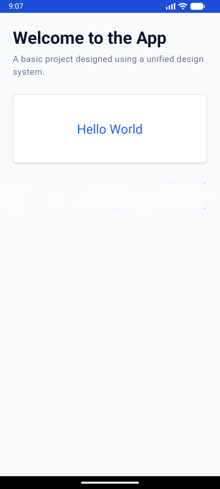
</p>

### Task 2: Button Interaction

Introduction to event handling. Implements `MaterialButton` with interactive click listeners and UI feedback.

<p align="center">
  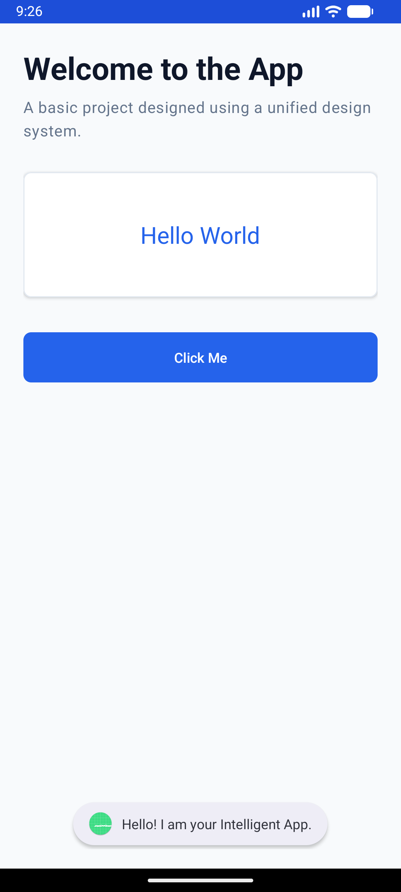
</p>

### Task 3: List Display

Working with structured data. Demonstrates the use of `ListView` and `ArrayAdapter` to display static intelligence assets.

<p align="center">
  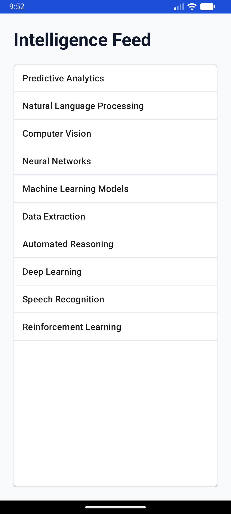
</p>

### Task 4: Multi-Activity Layout

Advanced navigation and data persistence. Features a 3-screen workflow (Onboarding -> Dashboard -> Profile) with `Intent` data passing.

<p align="center">
  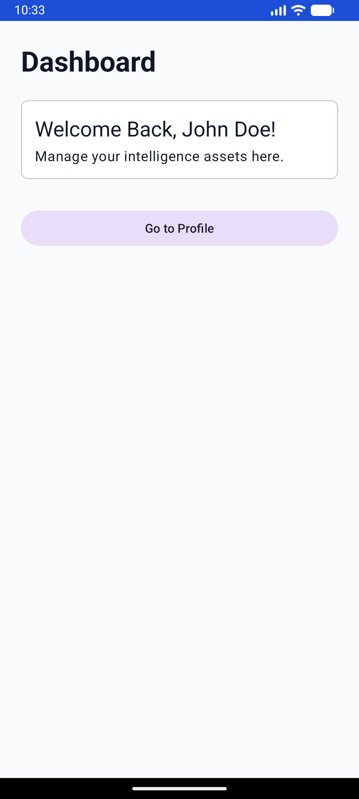
  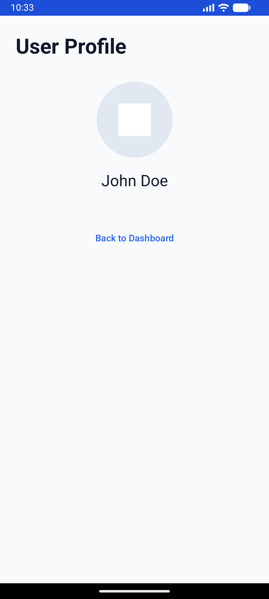
</p>

### Task 5: Dynamic Data (RecyclerView)

The peak of the curriculum. Implements a high-performance `RecyclerView` with custom `LayoutManager` and `AssetAdapter` for dynamic data modeling.

<p align="center">
  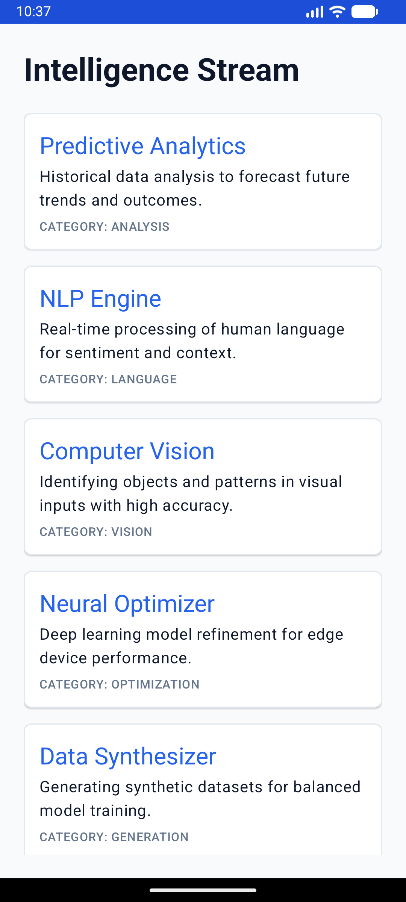
</p>

### Task 6: Form Submission

Implementation of user input handling and data validation. Features a professional form with `TextInputLayout`, real-time feedback, and `Toast` notifications upon submission.

<p align="center">
  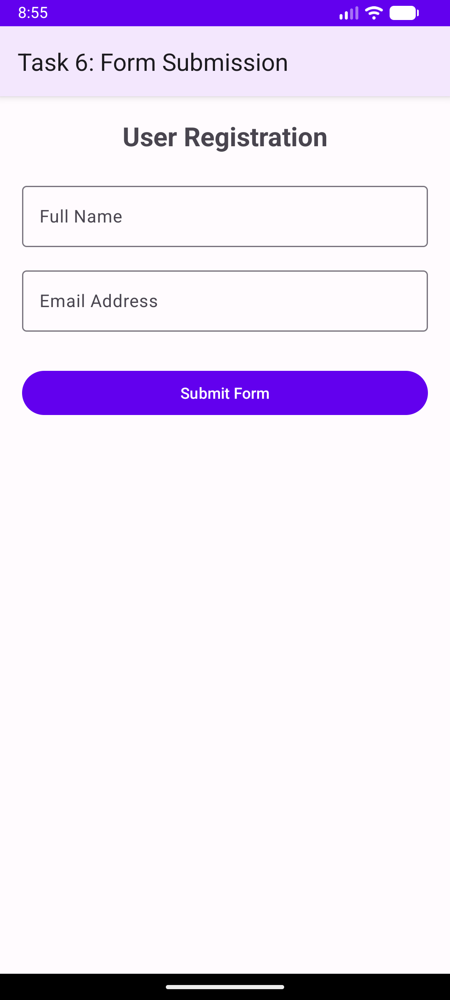
  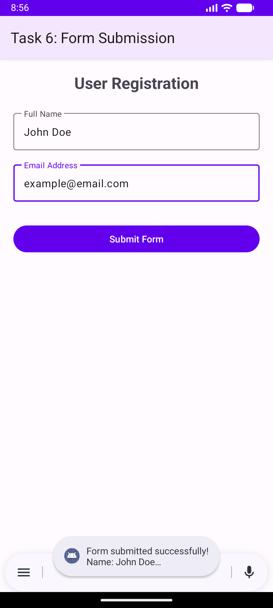
</p>

### Task 7: SQLite Database App

A full CRUD application demonstrating local data persistence. Features efficient database querying, data insertion, and list-view population from the local database.

<p align="center">
  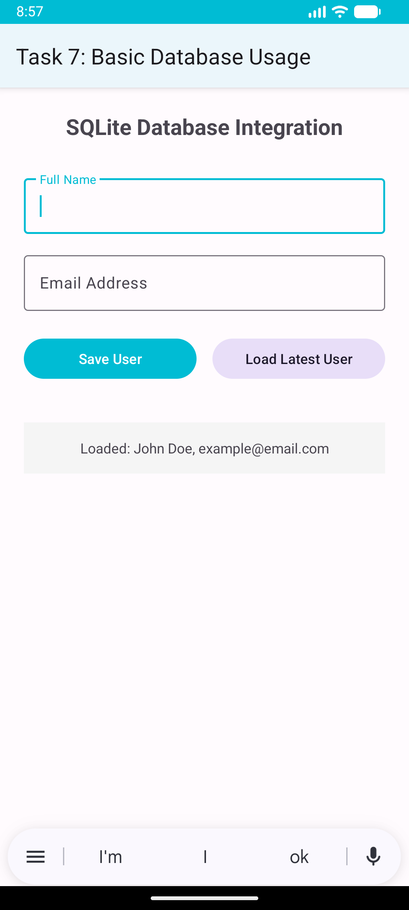
</p>

### Task 8: Navigation App

Advanced application logic showing screen-to-screen communication. Implements sophisticated `Intent` transitions and backstack management.

<p align="center">
  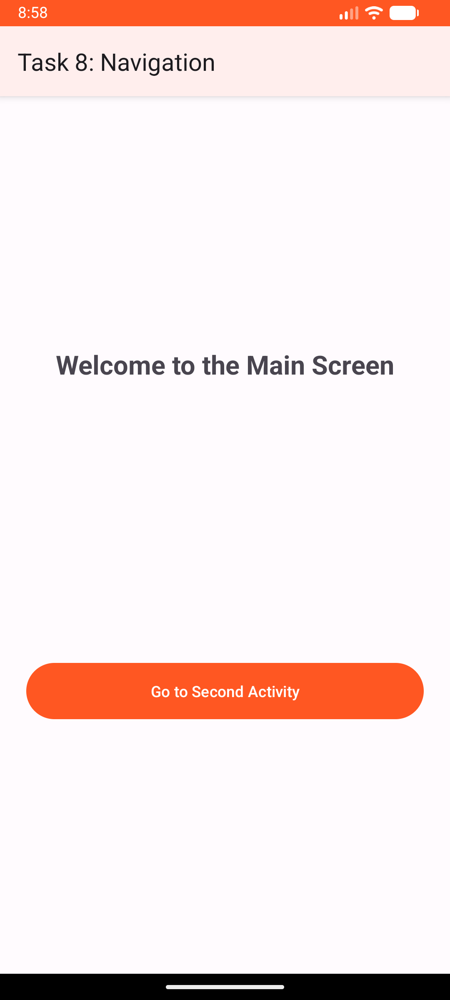
  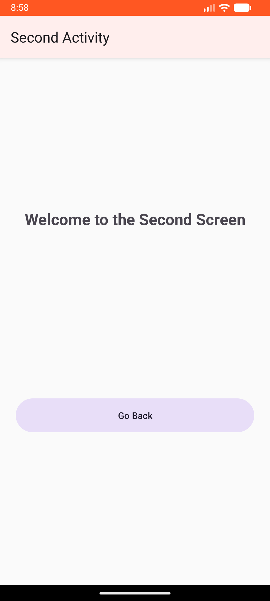
</p>

---

## Tech Stack & Requirements

- **Language**: Kotlin 1.9.22
- **Build System**: Gradle 8.11.1
- **Minimum SDK**: API 24 (Nougat)
- **Target SDK**: API 33 (Tiramisu)
- **UI**: Material Components 3 (M3)
- **Compatibility**: Pre-configured for **Java 21/25** environments.

---

## Quick Start

1. Clone this repository.
2. Open **Android Studio** (Hedgehog or newer).
3. Select `File > Open` and navigate to a specific `Task-` folder.
4. Wait for Gradle sync and press **Run**.

---

_Created as part of the Android Development Internship Program._
